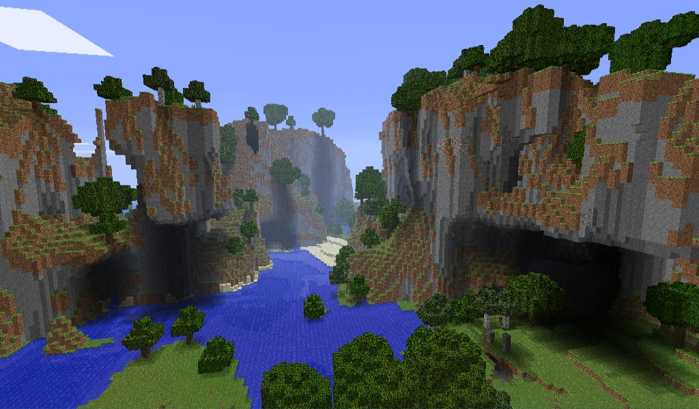

# Beta Wiki
A wiki documenting Minecraft Beta 1.7.3's networking protocol and other technical insights.

{: .note }
> This wiki is still a heavy wip. If you'd like something more complete,
> please check out the [links on the resources page](resources)

## Objective
To consolidate all knowledge on Minecrafts Legacy Protocols, specifically the way they were by Beta 1.7.3. This includes documenting both client and server behavior and communications, all while explaining it in such a way that anyone can make their own client or server with relative ease.

## Contributing
[Anyone can contribute to the Wiki](CONTRIBUTING)! Either through digging through decompiled code or just trial and error. Anything goes to make this the most objective source of truth for Minecraft Beta!

## TODO
Please check the [TODO Page](todo) to see what still needs to be done, or just click through the Wiki until you find something that's missing. Either open an issue on GitHub or try to solve it yourself!

## Contributors

## Star History

<picture>
  <source media="(prefers-color-scheme: dark)" srcset="https://api.star-history.com/svg?repos=OfficialPixelBrush/beta-wiki&type=Date&theme=dark" />
  <source media="(prefers-color-scheme: light)" srcset="https://api.star-history.com/svg?repos=OfficialPixelBrush/beta-wiki&type=Date" />
  
</picture>