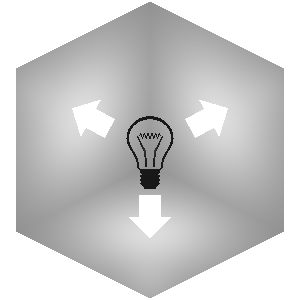

# Lighting
Every block has constant directional lighting, which is statically assigned based on
the angles of the faces. This is applied on top of any lighting calculated here after the fact.

## Light levels
Lighting in Minecraft is based on a 4-Bit gradient from `0` - `15`. As of Indev, this relationship is no longer linear.

If mapped from a range of `0.0` - `1.0`, where `1.0` represents a light level of `15`, we get the following mapping.

| 0 | 1 | 2 | 3 | 4 | 5 | 6 | 7 | 8 | 9 | 10 | 11 | 12 | 13 | 14 | 15 |
| --- | --- | --- | --- | --- | --- | --- | --- | --- | --- | --- | --- | --- | --- | --- | --- |
| 0.035 | 0.044 | 0.055 | 0.069 | 0.086 | 0.107 | 0.134 | 0.168 | 0.21 | 0.262 | 0.328 | 0.41 | 0.512 | 0.64 | 0.8 | 1.0f |

Or in code from

```c
const float lightArray[16] = { 0.035f, 0.044f, 0.055f, 0.069f, 0.086f, 0.107f, 0.134f, 0.168f, 0.21f, 0.262f, 0.328f, 0.41f, 0.512f, 0.64f, 0.8f, 1.0f };
```

## Per-block lighting
The illumination of a face is determined by the light level of the block its facing, i.e. the top of a grass block with a torch on it would get the full light level of `14`.


## Smooth Lighting
Every vertex samples and averages the light level of surrounding blocks along the direction of the face its part of. This provides ambient occlusion without any additional work, since solid blocks have a total light level of `0`.