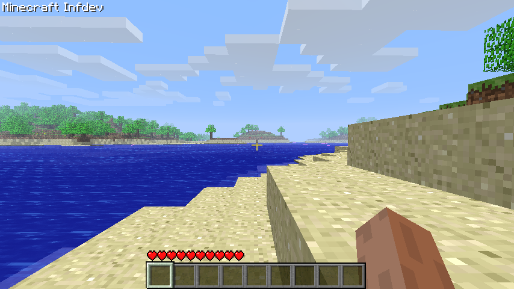
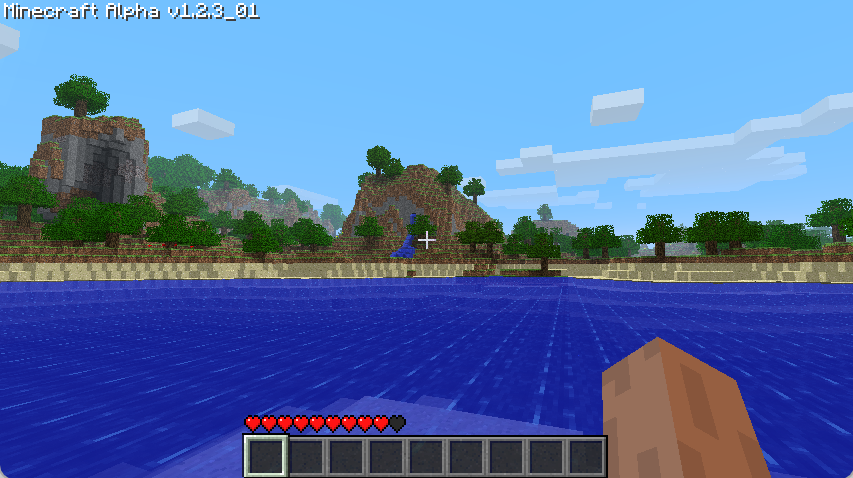
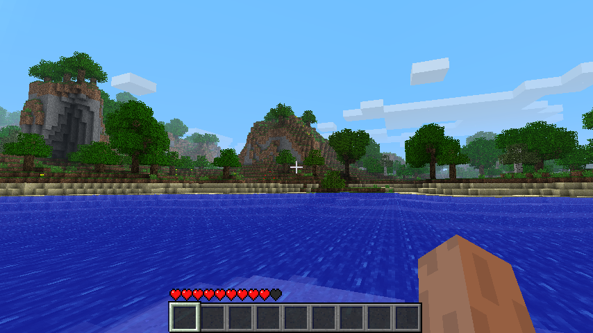
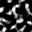

{: .missing }
> A huge chunk of info is still missing, mainly relating to tree, cave and ore generation.

# Generation
{: .no_toc }
The generation described in this section will explain how Minecraft Beta 1.7.3 does its Terrain Generation. A lot of this will be based on educated guesses and the decompilation provided by [RetroMCP](https://github.com/MCPHackers/RetroMCP-Java). Additionally, certain historical bits and pieces will be taken from the [Minecraft Wiki](https://minecraft.wiki/w/World_generation/History#Beta-era_terrain).

1. TOC
{:toc}

{: .note }
> The seed used throughout all of these comparisons is `3257840388504953787`, the seed behind [`pack.png`](https://minecraftathome.com/projects/packpng.html).

## History
The first version to have the Beta-era generator was Alpha 1.2.0, and it was used up until Beta 1.7.3.

However, we can see that the general shape of the terrain remains the same by using the same seed and spawn location in Alpha 1.1.2 (pre-rework), Alpha 1.2.3 (post-rework) and Beta 1.7.3.

| A1.1.2 | A1.2.3 |
| --- | --- |
|  |  |

This similar pre-1.2.0 generation dates all the way back to Infdev 20100624, before which the world generation looked entirely different.

| Inf20100624 | A1.1.2 |
| --- | --- |
|  |  |

Facing the other way reveals some of the more glaring differences between the generators.

| A1.1.2 | A1.2.3 |
| --- | --- |
|  |  |

Between Alpha 1.2.3 and Beta 1.7.3 there only exist minor differences, mainly relating to the feature generation.

| A1.2.3 | B1.7.3 |
| --- | --- |
|  |  |

## Biomes
To find out more about what Biomes exist and how they're defined, check out [the Biomes page](biomes).

This process utilizes 3 octaved [Simplex Noise](../technical/noise#simplex-noise) generators called Temperature, Humidity and Weirdness.

With this a `16x16` Biome Array is generated, where any block column can contain any of the 13 Biomes.

| Temperature | Humidity | Weirdness |
| :---: | :---: | :---: |
|  |  |  |

Temperature, humidity and weirdness values from `0,0` to `32,32` after being modified by this function. These values are in the `0.0 - 1.0` range.

## Terrain Shape
### Noise Octaves
The Beta 1.7.3 Terrain Generator has a shared [Pseudorandom Number Generator](../technical/random), alongside 8 [Octaved Perlin Noise Generators](../technical/noise), 7 of which are relevant for World generation.

| Generator | Octaves | Scale |
| :--- | --- | ---: |
| Low Noise | `16` | `(684.412, 684.412, 684.412)` |
| High Noise | `16` | `(684.412, 684.412, 684.412)` |
| Selector Noise | `8` | `(684.412 / 80.0, 684.412 / 160.0, 684.412 / 80.0)` |
| ? | `10` | `(1.121, 1.121, 0.5)` |
| Depth Noise | `16` | `(200.0, 200.0, 0.5)` |
| Mob Spawner Noise | `8` | |

### Terrain Noise
This function utilizes 5 of our Perlin Noise Generators, 2 in 2D and 3 in 3D.
The result of this is placed into a `4x16x4` Double Array that describes our terrain at a reduced scale.

### Interpolation
Minecraft uses [Trillinear interpolation](https://en.wikipedia.org/wiki/Trilinear_interpolation) to interpolate between the generated density values, to scale them up to the final `16x128x16` chunk size.

The actual decision which blocks are solid or not comes down to the following function.
```c
uint8_t blockType = BLOCK_AIR;
// If water is too cold, turn it into ice
double temp = temperature[columnIndex];
if(y < WATER_LEVEL) {
  if(temp < 0.5 && y >= WATER_LEVEL - 1) {
    blockType = BLOCK_ICE;
  } else {
    blockType = BLOCK_WATER_STILL;
  }
}
// Decide which blocks are solid or not
if(noiseValue > 0.0) blockType = BLOCK_STONE;
// Write to chunk
blocks[blockIndex].type = blockType;
```
Some of the values appear to modify themselves for the next loop.

| Terrain | Terrain with water level |
| --- | --- |
|  |  |

Highest stone blocks from `0,0` to `32,32`. These values are in the `0 - 127` range (scaled to `0 - 255` in the image).

## Biome Blocks
After the terrain shape has been generated, the chunk is transformed further by the Sand, Gravel and Stone Perlin Noise Generators.

| Generator | Octaves | Scale |
| :--- | --- | ---: |
| Sand & Gravel Noise (Sand) | `4` | `(1/32, 1/32, 1.0)` |
| Sand & Gravel Noise (Gravel) | `4` | `(1/32, 1.0, 1/32)` |
| Stone Noise | `4` | `(1/16, 1/16, 1/16)` |

The chunk is now iterated over in a nested x and z for-loop.
1. The biome for the specified column is read
2. Its checked if sand is possible to be placed here 
3. Its checked if gravel is possible to be placed here 
4. An integer is generated for if stone can be placed here
5. The biomes appropriate top and filler block is chosen (e.g. Grass and Dirt)

For this the current block column is iterated over from top to bottom, from `127` down to `0`.

6. If we're at `0`, place Bedrock, plus some random Bedrock up to `5` blocks away.
7. Get the current block, if it's air go to next loop, if its stone, continue
8. If the stone integer is `<= 0`, set the top block to air and the filler block to stone
9. TODO

{: .note }
> I'm unsure if I like this format more than just pasted, commented code.

<script>
  document.addEventListener("DOMContentLoaded", function () {
    mediumZoom('img', {
      margin: 10,
      background: '#000000CC'
    });
  });
</script>

## Further Reading
- [Java Edition Far Lands/Infdev 20100327 to Beta 1.7.3](https://minecraft.wiki/w/Java_Edition_Far_Lands/Infdev_20100327_to_Beta_1.7.3)