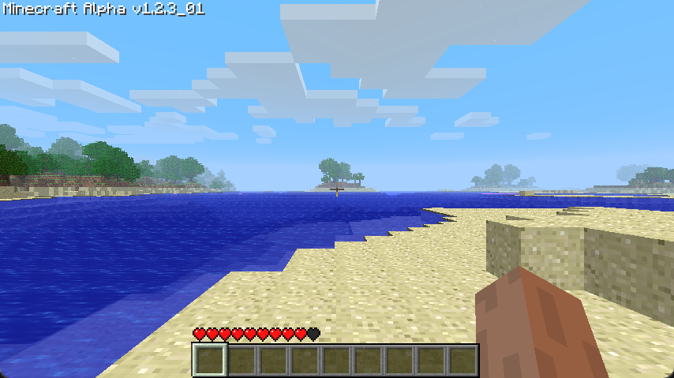

{: .missing }
> A huge chunk of info is still missing, mainly because I haven't yet worked my way to the Beta 1.7.3 Generator, so a lot will be guess-work or only relate to older versions.

# Generation
{: .no_toc }
The generation described in this section will explain how Minecraft Beta 1.7.3 does its Terrain Generation. A lot of this will be based on educated guesses and the decompilation provided by [RetroMCP](https://github.com/MCPHackers/RetroMCP-Java). Additionally, certain historical bits and pieces will be taken from the [Minecraft Wiki](https://minecraft.wiki/w/World_generation/History#Beta-era_terrain).

1. TOC
{:toc}

{: .note }
> The seed used throughout all of these comparisons is `3257840388504953787`, the seed behind [`pack.png`](https://minecraftathome.com/projects/packpng.html).

## History
The first version to have the Beta-era generator was Alpha 1.2.0, and it was used up until Beta 1.7.3.

However, we can see that the general shape of the terrain remains the same by using the same seed and spawn location in Alpha 1.1.2 (pre-rework), Alpha 1.2.3 (post-rework) and Beta 1.7.3.

| A1.1.2 | A1.2.3 |
| --- | --- |
|  |  |

This similar pre-1.2.0 generation dates all the way back to Infdev 20100624, before which the world generation looked entirely different.

| Inf20100624 | A1.1.2 |
| --- | --- |
|  |  |

Facing the other way reveals some of the more glaring differences between the generators.

| A1.1.2 | A1.2.3 |
| --- | --- |
|  |  |

Between Alpha 1.2.3 and Beta 1.7.3 there only exist minor differences, mainly relating to the feature generation.

| A1.2.3 | B1.7.3 |
| --- | --- |
|  |  |

## Biomes
To find out more about what Biomes exist and how they're defined, check out [the Biomes page](biomes).

This utilizes [Simplex Noise](../technical/noise#simplex-noise).

With this a `16x16` Biome Array is generated, where any cell can contain any of the 13 Biomes.

## Terrain Shape
### Noise Octaves
The Beta 1.7.3 Terrain Generator has a shared [Pseudorandom Number Generator](../technical/random), alongside 8 [Octaved Perlin Noise Generators](../technical/noise), 7 of which are relevant for World generation.

| Generator | Octaves |
| --- | --- |
| Low Noise | 16 |
| High Noise | 16 |
| Noise #1 | 8 |
| Sand & Gravel Noise | 4 |
| Stone Noise | 4 |
| Noise #2 | 10 |
| Noise #3 | 16 |
| Mob Spawner Noise | 8 |

{: .missing }
> Figure out proper names for these generators!

### Algorithm
The function that's called to generate Chunks is itself quite basic,
and pretty much just uses the output of a function that's called shortly before a set of
nested for-loops.

#### Terrain Noise
This function utilizes 5 of our Perlin Noise Generators, 2 in 2D and 3 in 3D.
The result of this is placed into another Array, which is a `16x16x16` Double Array that describes our terrain.

#### Interpolation
The basic loop looks roughly as follows.
```c
terrainArray = GenerateTerrainArray();
for(int macroX = 0; macroX < 4; ++macroX) {
  for(int macroZ = 0; macroZ < 4; ++macroZ) {
    for(int macroY = 0; macroY < 16; ++macroY) {
      // Here we get the 8 corners of our 3D terrain array

      // With the following loops we interpolate between those points
      for(int subY = 0; subY < 8; ++subY) {
        for(int subX = 0; subX < 4; ++subX) {
          for(int subZ = 0; subZ < 4; ++subZ) {
            // If the level is < 64, it's water
            // If noise is >0.0 the block is either stone or air
          }
        }
      }
    }
  }
}
```
Some of the values appear to modify themselves for the next loop.

## Biome Features
After the terrain shape has been generated, the chunk is transformed further by the Sand, Gravel and Stone Perlin Noise Generators.

<script>
  document.addEventListener("DOMContentLoaded", function () {
    mediumZoom('img', {
      margin: 10,
      background: '#000000CC'
    });
  });
</script>