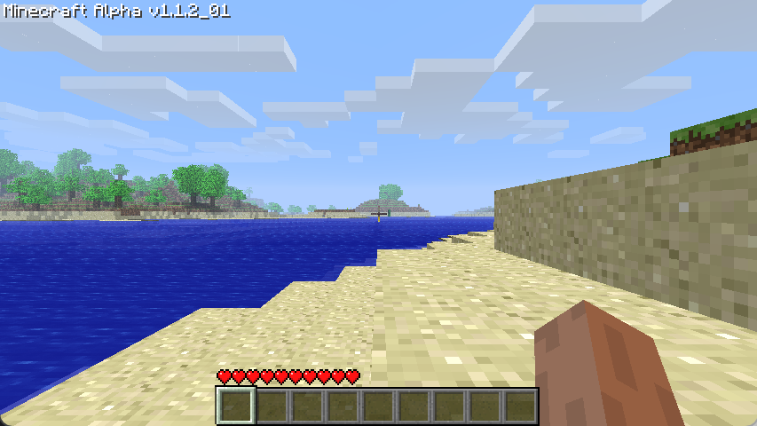
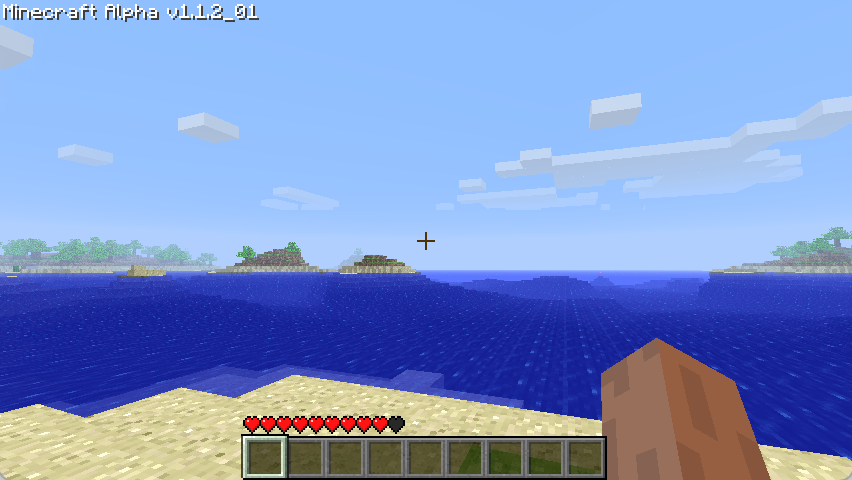
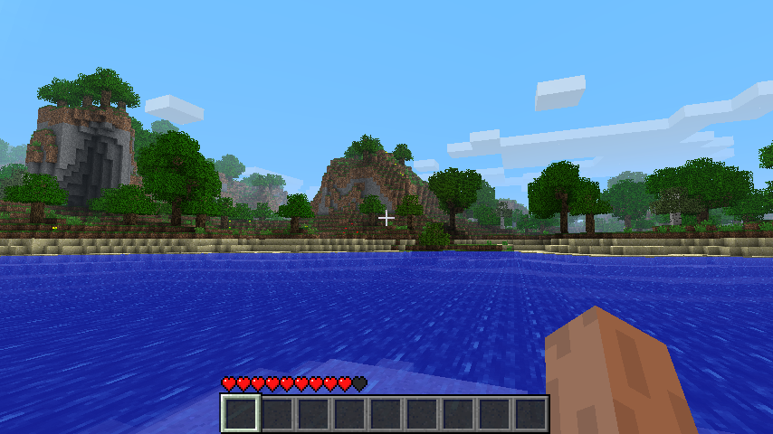

# Generation
{: .no_toc }
The generation described in this section will explain how Minecraft Beta 1.7.3 does its Terrain Generation. A lot of this will be based on educated guesses and the decompilation provided by RetroMCP. Additionally, certain historical bits and pieces will be taken from the [Minecraft Wiki](https://minecraft.wiki/w/World_generation/History#Beta-era_terrain).

1. TOC
{:toc}

## History
The first version to have the Beta-era generator was Alpha 1.2.0, and it was used up until Beta 1.7.3.

However, we can see that the general shape of the terrain remains the same by using the same seed and spawn location in Alpha 1.1.2 (pre-rework), Alpha 1.2.3 (post-rework) and Beta 1.7.3.

| A1.1.2 | A1.2.3 |
| --- | --- |
|  |  |

Facing the other way reveals some of the more glaring differences between the generators.

| A1.1.2 | A1.2.3 |
| --- | --- |
|  |  |

Between Alpha 1.2.3 and Beta 1.7.3 there only exist minor differences, mainly relating to the feature generation.

| A1.2.3 | B1.7.3 |
| --- | --- |
|  |  |

{: .note }
> The seed used throughout all of these comparisons is `3257840388504953787`, the seed behind [`pack.png`](https://minecraftathome.com/projects/packpng.html).